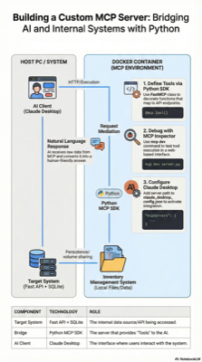
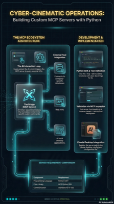
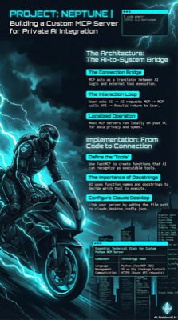
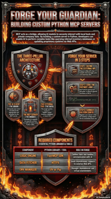
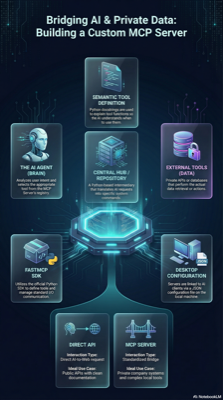
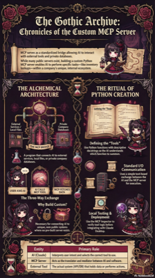
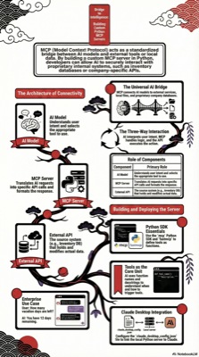
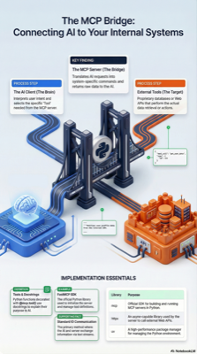

# notebooklm-prompts

A curated collection of design concept prompts for **NotebookLM Studio** — used when generating slides, diagrams, and visual presentations.

## What is this?

When using NotebookLM's Studio feature to create slides or other visual content, you can guide the AI with a design concept description to get consistently styled, professional-looking output.

This repository stores those design concept definitions in structured YAML format, so they can be reused, versioned, and shared.

## Concepts

| File | Name | Preview | Description |
|------|------|---------|-------------|
| [`minimalist-tech-pro-flow.yaml`](./minimalist-tech-pro-flow.yaml) | Minimalist Tech-Pro Flow |  | Clear hierarchy, logic-first layout with a touch of hand-drawn personality |
| [`cinematic-izakaya-narrative.yaml`](./cinematic-izakaya-narrative.yaml) | Cinematic Izakaya Narrative |  | Traditional Japanese pub atmosphere combined with high-contrast cinematic realism |
| [`containerized-tech-architecure-style.yaml`](./containerized-tech-architecure-style.yaml) | Containerized Tech-Architecture Style |  | An information-rich, organized technical style for Docker and system architecture diagrams |
| [`cyber-cinematic-operations.yaml`](./cyber-cinematic-operations.yaml) | Cyber-Cinematic Operations |  | Futuristic SRE dashboard style with high-contrast glow effects and holographic overlays |
| [`cyberpunk-tech-noir-terminal.yaml`](./cyberpunk-tech-noir-terminal.yaml) | Cyberpunk Tech-Noir Terminal |  | A design that reproduces a dark and gritty cyberpunk world with pale blue neon text and midnight city accents |
| [`flaming-steel-gurdian-cli.yaml`](./flaming-steel-gurdian-cli.yaml) | Flaming Steel Guardian CLI |  | Dark fantasy gaming UI mixed with industrial metallic elements |
| [`futuristic-cyber-orchestrator.yaml`](./futuristic-cyber-orchestrator.yaml) | Futuristic Cyber-Orchestrator |  | A high-density, neon-infused layout representing a central AI hub controlling distributed agents |
| [`gothic-archive-chronicles.yaml`](./gothic-archive-chronicles.yaml) | Gothic Archive Chronicles |  | A blend of Victorian gothic aesthetics and modern data visualization |
| [`hanafuda-heritage-neo.yaml`](./hanafuda-heritage-neo.yaml) | Hanafuda Heritage Neo |  | A modern business adaptation of Hanafuda aesthetics, focusing on high-contrast symbolism and bold graphic layouts |
| [`isometric-bridge-tech-flow.yaml`](./isometric-bridge-tech-flow.yaml) | Isometric Bridge Tech-Flow |  | Server as a bridge and translator between two worlds, rendered in an isometric technical flow style |

## How to use

1. Open a concept YAML file and read the design parameters
2. Paste the relevant values into your NotebookLM Studio prompt when generating slides
3. The AI will apply the described style — colors, fonts, icon style, layout rules, etc.

## Contributing

Feel free to add your own design concepts. Follow the existing YAML structure and open a pull request.
